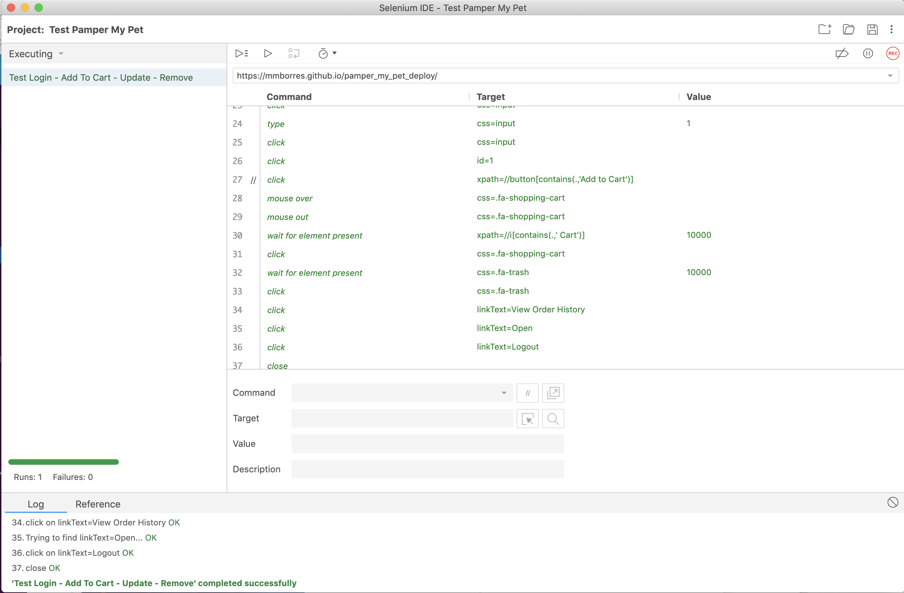
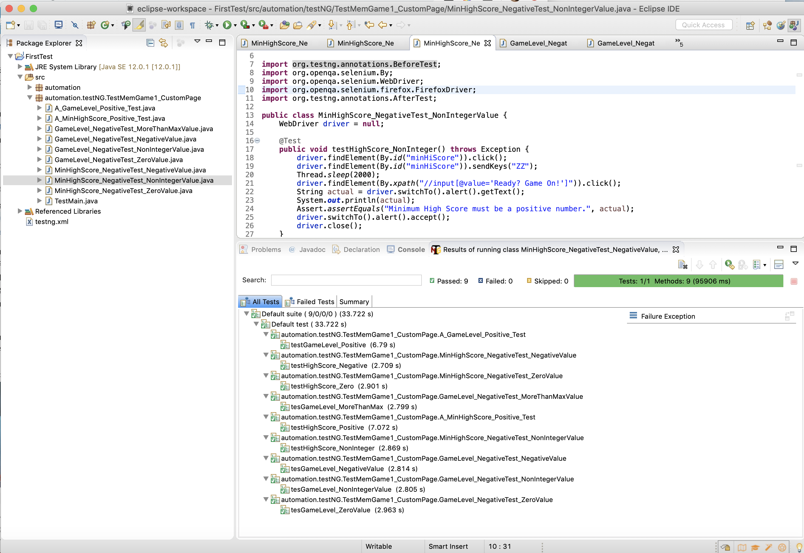
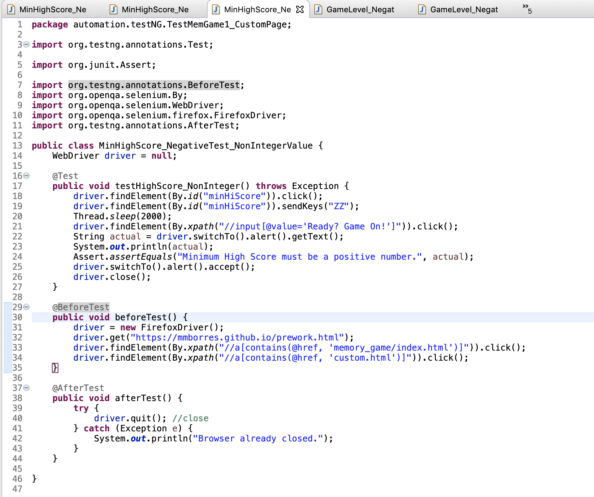
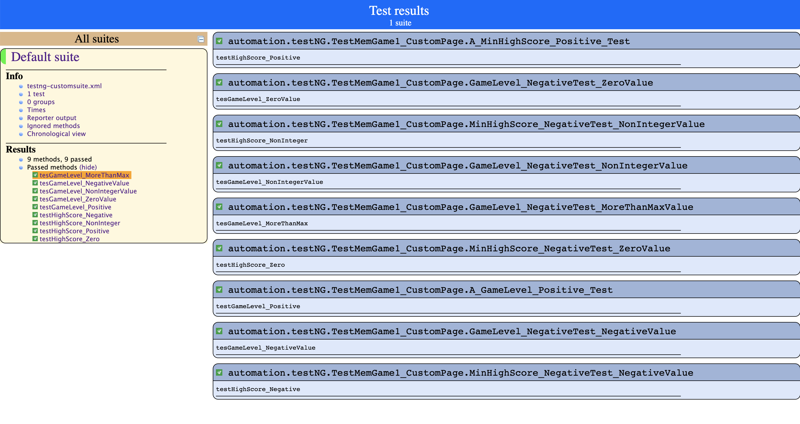

# mmborres.github.io

WDI Pre-work at GA by Mabeth Borres

Memory Card Game 2 Versions - LIVE Demo:

  1) Points-based: [Memory Game Score Top Up](https://mmborres.github.io/memory_game/)

  2) Difficulty levels: [Memory Game Level Up](https://mmborres.github.io/memgame_difficulty/)

# SELENIUM Tests 

Selenium Tests in IDE and WebDriver versions created for the GA project, and presented demos on Selenium IDE and Selenium 2/ WebDriver in the GA Software Engineering Immersive 31 class.

[Selenium Preso at GA](https://github.com/mmborres/mmborres.github.io/blob/master/Selenium.pdf)

[Selenium IDE Test Scripts](https://github.com/mmborres/mmborres.github.io/tree/master/selenium)

[Selenium WebDriver Java TestNG Codes](https://github.com/mmborres/mmborres.github.io/tree/master/selenium/webdriver-java/package_automation.testNG.TestMemGame1_CustomPage)

### Selenium IDE

### WebDriver in Java

### Java Code

### Generated Report

